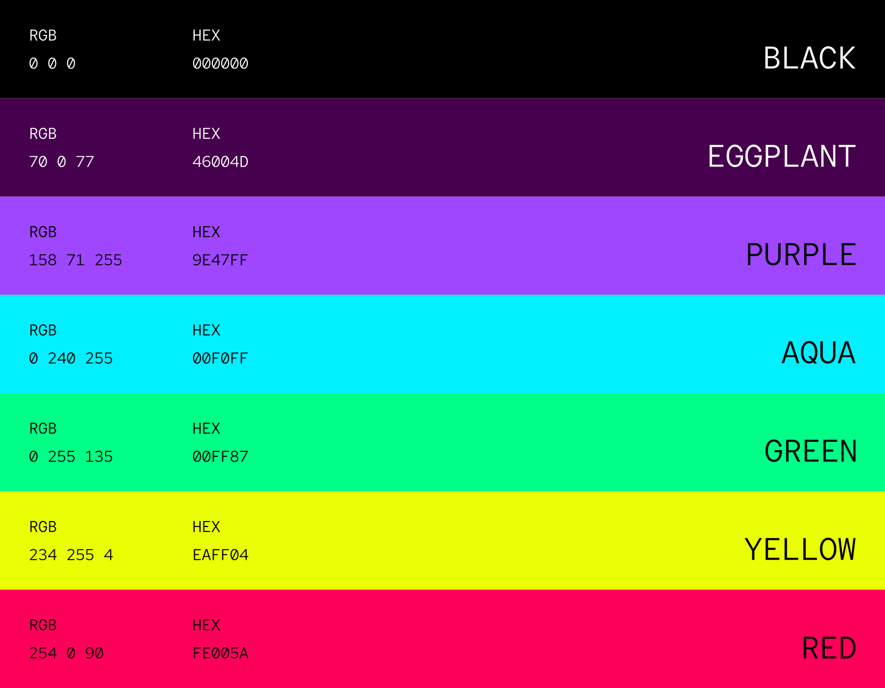

# Color Palette
 

## Main Color

| Color | HEX | RGBA |
| ----------- | ----------- | ----------- |
|  | `#46004D` | `rgba(70, 0, 77, 1)` |
|  | `#9E47FF` | `rgba(158, 71, 255, 1)` |

The main and constant colors of TahrLab brandy is eggplant and purple. These color should have priority over other colors on palette.

## Secondary Colors

| Color | HEX | RGBA |
| ----------- | ----------- | ----------- |
|  | `#00F0FF` | `rgba(0, 240, 255, 1)` |
|  | `#00FF87` | `rgba(0, 255, 135, 1)` |
|  | `#EAFF04` | `rgba(234, 255, 4, 1)` |
|  | `#FE005A` | `rgba(254, 0, 90, 1)` |
|  | `#000000` | `rgba(0, 0, 0, 1)` |

These are the secondary colors in addition to the primary color eggplant. These and the tones of these colors can be used as supporting colors while creating any visual asset.
